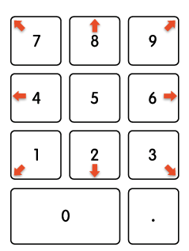
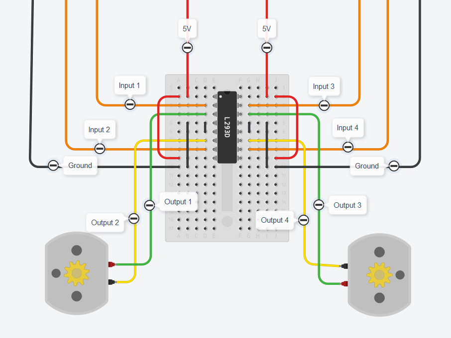

# piBot

A small rPi robot that drives through a maze

The piBot asks for a the port number of the client then runs a server via sockets that accepts a .txt file from the client. (FileReceiver.java)

The piBotClient.java runs on a computer from where you send the file. Gives you options to choose host, port and filename. Since the bot has been traveling back and forth...

The piBot reads the file and turns the lines into a char array , deleting the zeros. (Maze.java)

Then it reverses the array and returns the correct way to go since the start position is from the bottom.
(Of course you could write the maze upside down but that doesn't feel right)

In the Move.java class there are some additional movement options. 

(In case they are needed to improve the driving path. For use when driving through a corner part of the maze.)

The main class piBot.java is where it goes through the char array "path" and makes magic happen

The maze file should look like this
```
08000
08000
06840
00080
00080
```
This is an image to explain the logic of the controls



Bonus picture of the circuit build using an H-Bridge to be able to reverse and have more controls 

For example turning left (4) , turns the right motor forward and the left motor backwards. (Magic)

The input wires connect to the Raspberry Pi


